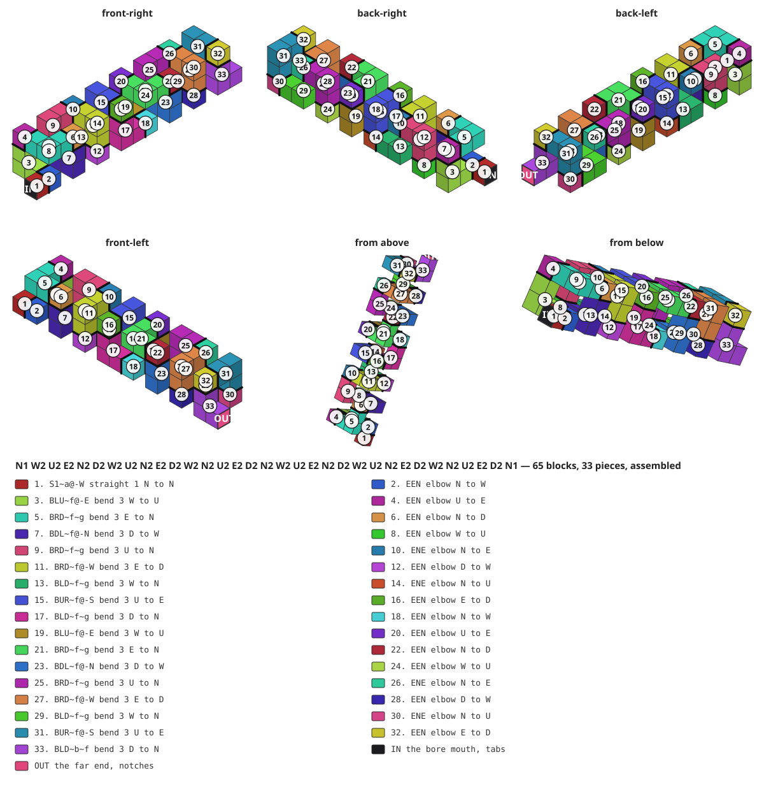

# The tight coil

A trumpet bore wound as tightly as a coil can go without touching itself.
**65 blocks, 1040mm of centreline, 33 sections, six whole turns at 42.7mm a
turn, nothing touching — and 16 elbows**, one at every other piece. It is the
tightest coil in this repository whose blocks never meet, and it buys that by
cutting the turns the generator cannot fold.

<!-- readme-only -->
**[Read this page](https://gernreich.github.io/trumpet-elbows-allowed/tight-coil/)**

**[Turn it →](../parts/bore/concept/walk/coil/tight/bore/bore.html)**
The viewer is a page of its own, not a frame in this one: drag to rotate, and
the slider reveals the bore a block at a time in the order you would glue it.



## The walk is the whole design

```
N1 W2 U2 E2 N2 D2 W2 U2 N2 E2 D2 W2 N2 U2 E2 D2 N2 W2 U2 E2 N2 D2 W2 U2 N2 E2 D2 W2 N2 U2 E2 D2 N1
```

The first term is the way you face at the mouth and how far you go before
anything turns; every term after it turns where you stand and then travels that
many blocks. So **the bore is 1 + the sum of the numbers** — 64 + 1 = 65. Axes
are Minecraft's: `U`/`D` are +Y/−Y, `N` is −Z, `S` is +Z, `E` is +X, `W` is −X.

It goes round `W U E D`, two blocks a side, and steps two blocks north after
every three sides, so the loop never sits in one plane. Three sides are three
quarters of a turn, so the coil advances 2⅔ blocks a turn — 42.7mm — and the
whole walk measures the same end to end: 16 blocks of axis in six turns. Eight groups of three sides make 24 sides — six whole turns —
and the walk ends on the same line it began: the first and last blocks are 16 blocks apart along
the axis and nowhere apart across it. The coil is right-handed, the same way
round as the three-turn trumpet.

The walk is kept in `../tools/walks/tight_coil.txt`, and `regress.py` beside it
names this folder as where its cut files land.

## Why it cannot be tighter

Two blocks is the shortest a side can be and the shortest a step along the axis
can be, if no block is to touch another. Each was tried one block shorter in
`bore_split.py`:

| walk | rise a turn | tube a turn | elbows | touching pairs |
| --- | ---: | ---: | ---: | ---: |
| **this one, sides 2, steps 2** | **42.7mm** | **10.8 blocks** | 16 | **0** |
| steps of 1 | 21.3mm | 9.7 blocks | 16 | 35 |
| sides of 1 | 42.7mm | 6.8 blocks | 32 | 8 |

All three are six turns with a one-block lead at each end. A step of one
block puts each turn face to face with the one before it, and a side of one
brings the loop's own sides together.

Contact is counted between blocks three or more apart along the bore, as
everywhere in this repository: blocks two apart touch at every turn, and that
is the geometry of turning rather than the bore coming back on itself.

## What it costs: an elbow at every other piece

Of the 31 terms between the two ends, 23 sit between terms on **different**
axes — `W2` between `N1` and `U2`, say — and a turn there needs a leg of 3 to
fold into a bend. The other 8 are hairpins, like the `U2` in `W2 U2 E2`, and 2
is enough for those. Cut to 2, the 23 short legs leave 16 turns with nothing to
fold into, and each is cut as an **elbow**: a single block that is a piece of
its own.

Raise those 23 legs to 3 and the first three turns are exactly the
[three-turn trumpet](../three-turn/)'s walk, which has no elbows and rises 64mm
a turn at the same 16mm block, rather than 42.7.

So the 33 pieces alternate: a straight at the mouth, then elbow, bend, elbow,
bend, to a bend at the bell. The 16 bends are three blocks each and the 16
elbows one.

**Seven elbows are left open on the inside of the turn** — sections 6, 10, 14,
18, 22, 26 and 30. An elbow's two openings share an edge, so the inside corner
of the turn has no wall of its own; a neighbour normally closes it with a
tongue, a wall run one ply past the joint. At these seven neither neighbour can
put the tongue on a wall, so the generator leaves the corner open rather than
guessing. It is not a leak — the neighbours' walls and the elbow's plates seal
it from outside — but it is a 3 × 3mm notch along the inside of the turn, and a
joint with less glue on it. The other nine elbows are closed.

## The numbers

| | |
| --- | --- |
| blocks | 65 |
| centreline | 1040mm |
| sections | 33 — 1 straight, 16 elbows, 16 bends |
| parts | 164, over 33 sheets |
| bounding box | 48 × 48 × 272mm — 3 × 3 × 17 blocks |
| airway | 10mm square, constant |
| block pitch | 16mm — 10mm of air in 3mm walls |
| rise | 42.7mm a turn — 2⅔ blocks — over six whole turns |
| elbows | 16; seven of them open on the inside of the turn |
| contact | none |
| legs | north 17, west 12, east 12, up 12, down 12 |
| with the ends | 1283mm — 90mm mouthpiece, 1040mm bore, 153mm bell |

## The 33 sections

Numbered from the mouthpiece; assemble in order. A section is one flat snake,
so it is one SVG, and every part is engraved with its section number because
the sections only go together one way.

| # | blocks | kind | in → out | plate | shape | parts | sheet |
| --- | --- | --- | --- | --- | --- | --- | --- |
| 1 | 1 | straight | N → N | 1×1 | `S1~a@-W` | 4 | 122 × 40mm |
| 2 | 2 | elbow | N → W | 1×1 | `EEN` | 4 | 128 × 40mm |
| 3 | 3–5 | bend | W → U | 2×2 | `BLU~f@-E` | 6 | 253 × 56mm |
| 4 | 6 | elbow | U → E | 1×1 | `EEN` | 4 | 128 × 40mm |
| 5 | 7–9 | bend | E → N | 2×2 | `BRD~f~g` | 6 | 250 × 56mm |
| 6 | 10 | elbow | N → D | 1×1 | `EEN` | 4 | 128 × 40mm |
| 7 | 11–13 | bend | D → W | 2×2 | `BDL~f@-N` | 6 | 250 × 59mm |
| 8 | 14 | elbow | W → U | 1×1 | `EEN` | 4 | 128 × 40mm |
| 9 | 15–17 | bend | U → N | 2×2 | `BRD~f~g` | 6 | 250 × 56mm |
| 10 | 18 | elbow | N → E | 1×1 | `ENE` | 4 | 122 × 43mm |
| 11 | 19–21 | bend | E → D | 2×2 | `BRD~f@-W` | 6 | 253 × 56mm |
| 12 | 22 | elbow | D → W | 1×1 | `EEN` | 4 | 128 × 40mm |
| 13 | 23–25 | bend | W → N | 2×2 | `BLD~f~g` | 6 | 250 × 56mm |
| 14 | 26 | elbow | N → U | 1×1 | `ENE` | 4 | 122 × 43mm |
| 15 | 27–29 | bend | U → E | 2×2 | `BUR~f@-S` | 6 | 250 × 59mm |
| 16 | 30 | elbow | E → D | 1×1 | `EEN` | 4 | 128 × 40mm |
| 17 | 31–33 | bend | D → N | 2×2 | `BLD~f~g` | 6 | 250 × 56mm |
| 18 | 34 | elbow | N → W | 1×1 | `EEN` | 4 | 128 × 40mm |
| 19 | 35–37 | bend | W → U | 2×2 | `BLU~f@-E` | 6 | 253 × 56mm |
| 20 | 38 | elbow | U → E | 1×1 | `EEN` | 4 | 128 × 40mm |
| 21 | 39–41 | bend | E → N | 2×2 | `BRD~f~g` | 6 | 250 × 56mm |
| 22 | 42 | elbow | N → D | 1×1 | `EEN` | 4 | 128 × 40mm |
| 23 | 43–45 | bend | D → W | 2×2 | `BDL~f@-N` | 6 | 250 × 59mm |
| 24 | 46 | elbow | W → U | 1×1 | `EEN` | 4 | 128 × 40mm |
| 25 | 47–49 | bend | U → N | 2×2 | `BRD~f~g` | 6 | 250 × 56mm |
| 26 | 50 | elbow | N → E | 1×1 | `ENE` | 4 | 122 × 43mm |
| 27 | 51–53 | bend | E → D | 2×2 | `BRD~f@-W` | 6 | 253 × 56mm |
| 28 | 54 | elbow | D → W | 1×1 | `EEN` | 4 | 128 × 40mm |
| 29 | 55–57 | bend | W → N | 2×2 | `BLD~f~g` | 6 | 250 × 56mm |
| 30 | 58 | elbow | N → U | 1×1 | `ENE` | 4 | 122 × 43mm |
| 31 | 59–61 | bend | U → E | 2×2 | `BUR~f@-S` | 6 | 250 × 59mm |
| 32 | 62 | elbow | E → D | 1×1 | `EEN` | 4 | 128 × 40mm |
| 33 | 63–65 | bend | D → N | 2×2 | `BLD~b~f` | 6 | 250 × 56mm |

`~a` and `~b` are the plain ends, where the mouthpiece and the bell land; the
file names say `buttin` and `buttout`. `@` names a wall that runs on as a
tongue into the elbow beside it, and `~f` and `~g` mark a piece whose plate is
flattened where it meets an elbow.

Several sections are the same shape — the twelve `EEN` elbows are one, the four
`ENE` elbows another, and fifteen of the bends fall into six shapes — but each
is cut separately so that it carries its own number.

## The cut files

In `../parts/bore/concept/walk/coil/tight/bore/cut-files/`:

```
bore10-coil-tight-01of33-straight1-lapW-buttin-cut-files.svg
bore10-coil-tight-02of33-elbow-EN-cut-files.svg
bore10-coil-tight-03of33-bend-LU-lapE-flatin-cut-files.svg
bore10-coil-tight-04of33-elbow-EN-cut-files.svg
bore10-coil-tight-05of33-bend-RD-flatin-flatout-cut-files.svg
bore10-coil-tight-06of33-elbow-EN-cut-files.svg
bore10-coil-tight-07of33-bend-DL-lapN-flatin-cut-files.svg
bore10-coil-tight-08of33-elbow-EN-cut-files.svg
bore10-coil-tight-09of33-bend-RD-flatin-flatout-cut-files.svg
bore10-coil-tight-10of33-elbow-NE-cut-files.svg
bore10-coil-tight-11of33-bend-RD-lapW-flatin-cut-files.svg
bore10-coil-tight-12of33-elbow-EN-cut-files.svg
bore10-coil-tight-13of33-bend-LD-flatin-flatout-cut-files.svg
bore10-coil-tight-14of33-elbow-NE-cut-files.svg
bore10-coil-tight-15of33-bend-UR-lapS-flatin-cut-files.svg
bore10-coil-tight-16of33-elbow-EN-cut-files.svg
bore10-coil-tight-17of33-bend-LD-flatin-flatout-cut-files.svg
bore10-coil-tight-18of33-elbow-EN-cut-files.svg
bore10-coil-tight-19of33-bend-LU-lapE-flatin-cut-files.svg
bore10-coil-tight-20of33-elbow-EN-cut-files.svg
bore10-coil-tight-21of33-bend-RD-flatin-flatout-cut-files.svg
bore10-coil-tight-22of33-elbow-EN-cut-files.svg
bore10-coil-tight-23of33-bend-DL-lapN-flatin-cut-files.svg
bore10-coil-tight-24of33-elbow-EN-cut-files.svg
bore10-coil-tight-25of33-bend-RD-flatin-flatout-cut-files.svg
bore10-coil-tight-26of33-elbow-NE-cut-files.svg
bore10-coil-tight-27of33-bend-RD-lapW-flatin-cut-files.svg
bore10-coil-tight-28of33-elbow-EN-cut-files.svg
bore10-coil-tight-29of33-bend-LD-flatin-flatout-cut-files.svg
bore10-coil-tight-30of33-elbow-NE-cut-files.svg
bore10-coil-tight-31of33-bend-UR-lapS-flatin-cut-files.svg
bore10-coil-tight-32of33-elbow-EN-cut-files.svg
bore10-coil-tight-33of33-bend-LD-buttout-flatin-cut-files.svg
```

Every file is millimetre-true at 1 user unit = 1mm. **Blue engraves, then black
cuts** — blue writes the section number on every part, black frees it.

## Rebuild it

The generator lives in `tools/` at the repository root, and both commands run
from there. Report only, writing nothing:

```
python3 tools/bore_split.py tools/walks/tight_coil.txt --no-write
```

Writing rewrites every sheet in the folder and gates them, so it runs under the
venv python that has the gate's dependencies:

```
cd tools && ~/Software/boxes/venv/bin/python bore_split.py walks/tight_coil.txt \
    --write ../parts/bore/concept/walk/coil/tight/bore
```

## The two ends

Only the tube belongs to an instrument. Neither the mouthpiece nor the bell is
touched by the way a bore turns, and every bore here is on the same 10mm
channel, so one of each serves all of them —
**[the bell and the mouthpiece](../ends/)**. The walk opens and closes on a
single block, `N1`: the mouthpiece and the bell are long enough to carry the
instrument clear of the coil without a longer lead.

## More, and licence

**[The three-turn trumpet](../three-turn/)** — the bore that plays, and the
same coil with legs of 3 and no elbows.

**[The trumpet writeup](https://gernreich.github.io/trumpet-elbows-allowed/)** — the idea, the notation, the gate, and the whole
library.

**[The rest of the build files](https://gernreich.github.io/)** — every
instrument, each with its own writeup.

Released under [CC0 1.0](../LICENSE).
